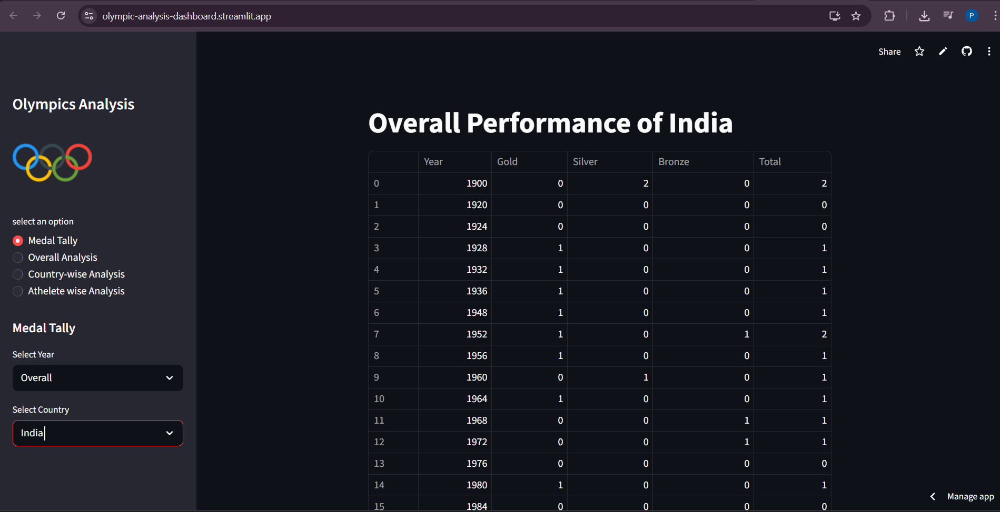

# 🏅 Olympic Data Analysis Web App

An interactive web application built with **Streamlit** to analyze 120 years of Olympic history data.

### 🚀 Live Demo
**Check out the app here:** [Click here to view the live app](https://olympic-analysis-dashboard.streamlit.app/) 

---

## 📊 Features
* **Medal Tally:** View the overall and year-wise medal standings for every country.
* **Overall Analysis:** Insights into the number of editions, participating nations, and sports over time.
* **Country-wise Analysis:** Track a specific country's performance history.
* **Athlete-wise Analysis:** Interactive visualizations showing the relationship between Height and Weight, and Age distributions for medalists.

## 🛠️ Tech Stack
* **Python** (Core Logic)
* **Streamlit** (Web Interface)
* **Pandas/Numpy** (Data Manipulation)
* **Plotly/Seaborn/Matplotlib** (Data Visualization)
